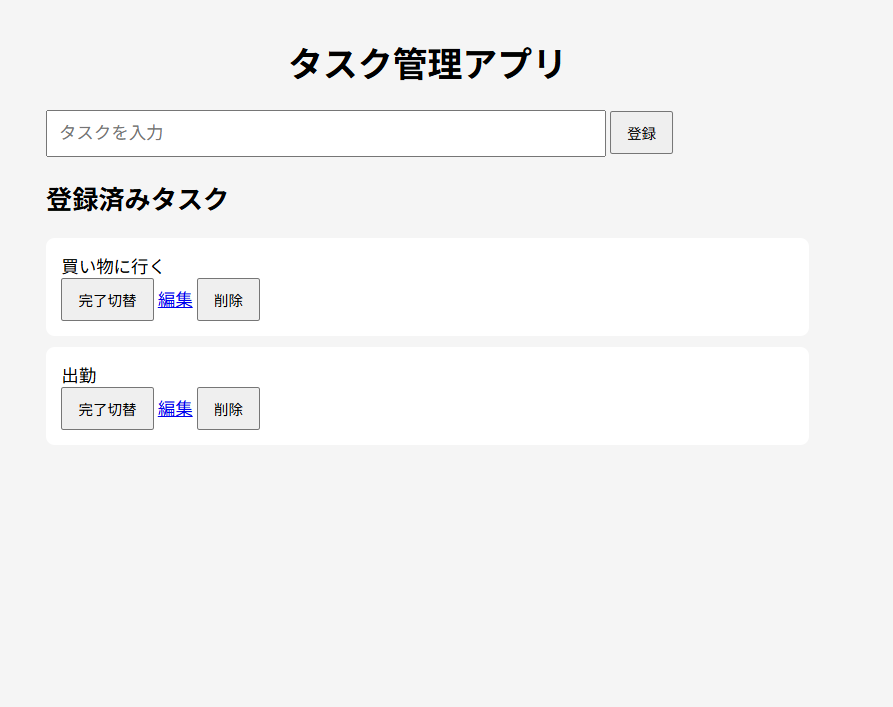

# Task App

TornadoとSQLiteを使ったシンプルなタスク管理Webアプリです。

## 主な機能

- タスク登録
- 一覧表示
- 編集
- 削除
- 完了 / 未完了切替
- 並び替え
- 空欄入力チェック
- 効果音

## スクリーンショット



## 使用技術

- Python
- Tornado
- SQLite
- HTML
- CSS
- JavaScript

## 起動方法

```bash
python app.py
```

ブラウザで以下を開きます。

http://localhost:8888

